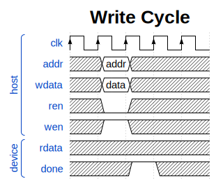
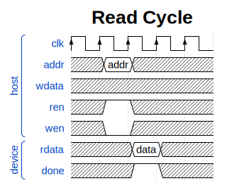
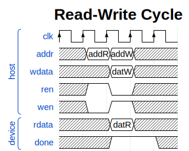
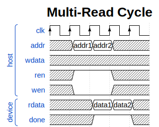

# Bus Design
All peripherals and processors in this project share a consistent bus interface. This bus interface is custom and unique to this project. Why not use [Wishbone](https://en.wikipedia.org/wiki/Wishbone_(computer_bus)) or some other pre-defined and standardized bus? I chose to create my own bus architecture because designing *every* component in this project from scratch has allowed me to gain a more intuitive understanding of computer architecture in general. If I chose to use something like Wishbone in this project, I would be building on something that many experienced people have already put a lot of thought into rather than doing so myself. In creating my own bus architecture, I made these design decisions myself and gained an understanding of *why* things like Wishbone exist, and why they are designed the way they are.

## Interface

The bus hub has a consistent interface for devices (peripherals, memory, etc.) as well as for the host (CPU).

Device interface: 
```systemverilog
// Device ports * 1
output wire [32:0] device_address, // Address requested by the HOST
output wire [32:0] device_data_write, // Write word
output wire [3:0] device_write_mask, // Byte mask for write
output wire [0:0] device_ren, // Read-enable
output wire [0:0] device_wen, // Write-enable
input wire [0:0] device_ready, // Device ready (finished)
input wire [31:0] device_data_read, // Read word
input wire [0:0] device_active // Device-self-select (see explanation)
```

Host Interface:
```systemverilog
input wire [31:0] host_address, // Bus transaction address
input wire [31:0] host_data_write, // Write word
input wire [3:0] host_write_mask, // Write byte mask
input wire host_ren, // Read-enable
input wire host_wen, // Write-enable
output reg [31:0] host_data_read, // Read word
output reg host_ready, // Transaction finished
```

On the device side, the bus hub provides wires for a 32-bit address, 32-bit write word, 32-bit read word, a 4-bit write mask (indicating which of the 4 separate bytes in the 32-bit word to write to), a read-enable bit, write-enable bit, and a ready bit (controlled by the device.)

## Demultiplexing
The bus hub incorporates an "active" (self-select) input from each separate bus device. The bus switch selects which device has access to the host based on each device's active bit. The active bits of all devices connected to the bus hub are fed into a priority encoder, and the device attached to the bus hub, asserting its device active signal with the highest priority is the device that receives read-enable, write-enable, and data signals from the host. The host also receives the ready signal and read word from this "selected" device.

If no devices assert the active signal on the bus hub, the host will read back all zeros and will receive a ready signal of zero.

This bus architecture allows for devices to manage their own memory space with respect to addressing on the bus, which requires less configuration of the bus hub and allows for more specialized logic inside of each device for addressing. Offloading address-management onto the peripherals allows for more flexibility in designing peripherals (allows me to mess around with things more), but is not a good design choice for systems with many devices, or systems with peripherals consisting of external IP that have unknown addressing behavior.

A Python script `hubgen.py` is provided for generating bus hubs with an arbitrary number of devices due to my difficulties with SystemVerilog's generate features.

## Timing Diagrams





## Memory Implementations.

Two memory implementations are provided for use on the bus currently:
- Simple
  - Implemented as a SystemVerilog packed array
  - Can be configured for any arbitrary amount of words 
  - Arbitrary start address
  - Can contain initialization data provided as a binary or hex file.
  - Intended for use on any FPGA that supports memory (BRAM) inference from unpacked SystemVerilog arrays as well as for simulation.
- ICE40 SPRAM
  - Uses the quad 256 Kilobit SPRAM memories of ICE40 UltraPlus-series FPGAs
  - 32K words of random access memory
  - Does not allow initialization data.
  - Arbitrary start/base address